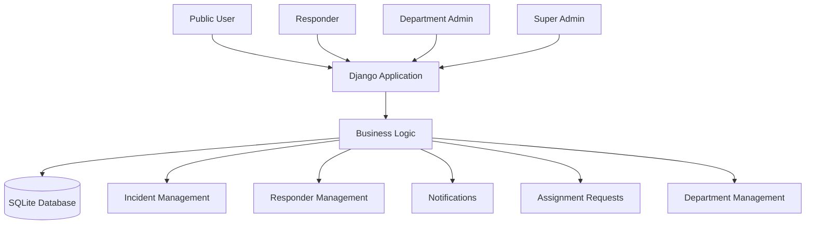
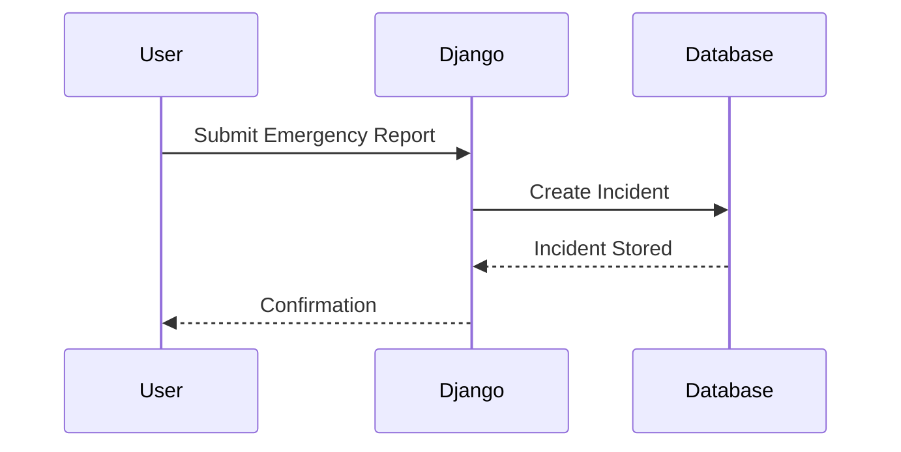
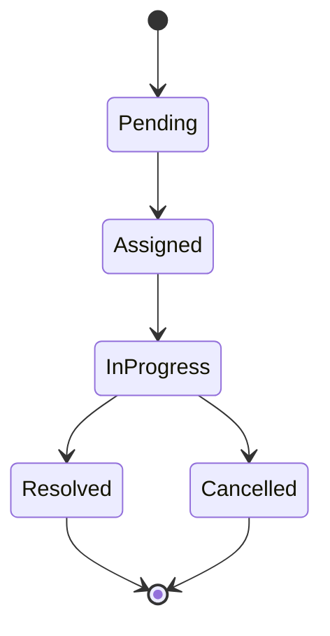
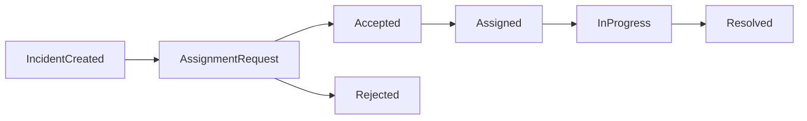
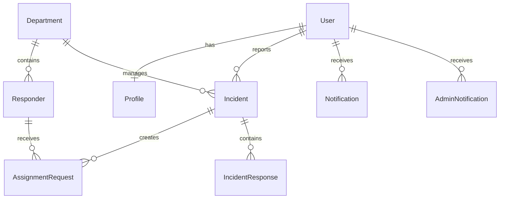

# Emergency Response System

## Overview

The Emergency Response System (ERS) is a web-based incident reporting and emergency coordination platform built with Django.

The system enables members of the public to report emergencies, allows emergency departments to manage incidents relevant to their jurisdiction, and provides responders with a structured workflow for receiving, accepting, handling, and resolving emergency incidents.

The application was developed to address the communication and coordination challenges that often arise during emergency situations by centralizing incident reporting, responder assignment, department management, notification handling, and incident lifecycle tracking within a single platform.

The project is currently under active development and should be viewed as a continuously evolving system rather than a finished production deployment.

---

# Problem Statement

Emergency incidents are frequently reported through fragmented channels such as phone calls, messaging applications, or physical reporting centers.

These approaches often create challenges including:

* Delayed response times
* Poor visibility of active incidents
* Difficult responder coordination
* Lack of accountability during assignment
* Inconsistent incident tracking
* Limited operational awareness

This system attempts to address those challenges by introducing a centralized digital workflow for emergency reporting and response coordination.

---

# Objectives

The primary objectives of the project are:

* Provide a centralized emergency reporting platform
* Improve visibility of active incidents
* Enable efficient responder assignment
* Support department-based incident management
* Track incidents through their full lifecycle
* Improve communication between administrators and responders
* Provide geographic context for emergency events
* Maintain auditability of emergency response actions

---

# Key Features

## Authentication & User Management

* User registration
* User login/logout
* Django authentication integration
* User profile management
* Role-based permissions
* Emergency user profiles
* Department-based access control

---

## Incident Reporting

Users can:

* Report emergencies
* Submit incident details
* Provide location information
* Track incident progress
* View incident details

Incident records become part of the emergency response workflow after submission.

---

## Incident Management

Authorized personnel can:

* View incidents
* Filter incidents
* Manage incident status
* Monitor incident progress
* Resolve incidents
* Cancel incidents

---

## Department Management

The system supports departmental organization.

Departments act as organizational units responsible for handling incidents and managing responders.

Features include:

* Department creation
* Department administration
* Department-based filtering
* Department responder management

---

## Responder Management

Responders represent emergency personnel assigned to incidents.

Capabilities include:

* Responder registration
* Availability tracking
* Location tracking
* Department assignment
* Incident assignment handling
* Status management

---

## Assignment Requests

The system implements a responder assignment workflow.

Features include:

* Assignment request creation
* Assignment approval workflow
* Assignment acceptance
* Assignment rejection
* Assignment tracking

This provides accountability before an incident becomes actively assigned.

---

## Notification System

The platform includes multiple notification mechanisms.

### User Notifications

Used to communicate incident-related updates.

### Administrative Notifications

Used to notify administrators about operational events such as:

* Assignment activity
* Incident updates
* Responder actions

---

## Maps & Location Services

The application integrates mapping functionality using Leaflet.

Location features include:

* Incident locations
* Responder locations
* Geographic visualization
* Map-based incident context

---

## Dashboards

The platform provides role-specific dashboards that expose information relevant to each user type.

Examples include:

* User dashboards
* Responder dashboards
* Department administration views
* System administration views

---

# System Users & Roles

The system currently supports four primary roles.

## Public User

Public users can:

* Register accounts
* Log in
* Report emergencies
* View their incidents
* Manage their profiles

---

## Responder

Responders can:

* View assigned incidents
* Update status
* Accept assignments
* Reject assignments
* Update location information
* Resolve incidents

---

## Department Administrator

Department administrators can:

* Manage department responders
* View department incidents
* Coordinate assignments
* Monitor operational activity

Access is generally limited to resources associated with their department.

---

## Super Administrator

Super administrators have platform-wide visibility.

Responsibilities include:

* Managing departments
* Managing responders
* Viewing all incidents
* Monitoring system activity
* Administrative oversight

---

# System Architecture



---

# High-Level Request Flow



---

# Incident Lifecycle

The system currently supports a structured incident workflow.

## Incident Statuses

* Pending
* Assigned
* In Progress
* Resolved
* Cancelled

### Lifecycle Diagram



---

# Responder Assignment Workflow



---

# Core Data Model

The project contains several core domain models.

---

## Profile

Extends Django's built-in User model.

Responsibilities:

* Personal information
* User metadata
* Role management support

---

## Department

Represents an emergency service department.

Examples:

* Fire Services
* Medical Services
* Police Services

Responsibilities:

* Organizational grouping
* Responder ownership
* Incident visibility boundaries

---

## Responder

Represents emergency personnel.

Responsibilities:

* Incident response
* Availability tracking
* Location tracking
* Department affiliation

Key concepts:

* Current status
* Geographic location
* Department membership

---

## EmergencyUser

Represents emergency-reporting users and associated emergency-related information.

---

## Incident

The central model of the application.

Stores:

* Emergency details
* Incident type
* Location
* Reporting user
* Current status
* Department information

The Incident model drives most operational workflows.

---

## AssignmentRequest

Represents assignment approval and responder coordination processes.

Responsibilities:

* Assignment tracking
* Acceptance workflow
* Rejection workflow

---

## IncidentResponse

Stores responder activity related to incidents.

Provides historical tracking of incident handling actions.

---

## Notification

Used for user-facing notifications.

Examples:

* Assignment updates
* Incident status changes
* Operational messages

---

## AdminNotification

Used for administrative monitoring and workflow visibility.

---

# Database Relationship Overview



---

# Authentication & Authorization

The system uses Django's authentication framework.

Implemented protections include:

* Login-required views
* Role checks
* Department filtering
* Permission restrictions
* Ownership validation
* Administrative access controls

Authorization decisions are enforced throughout the application to ensure users only access permitted resources.

---

# Frontend Architecture

The user interface is built using:

* HTML5
* Bootstrap 5
* Django Templates
* JavaScript
* Leaflet

### Design Goals

* Responsive layouts
* Mobile-friendly navigation
* Readable dashboards
* Operational clarity
* Fast access to critical information

---

# Technology Stack

## Backend

* Python
* Django

## Frontend

* HTML5
* CSS3
* Bootstrap 5
* JavaScript

## Mapping

* Leaflet
* OpenStreetMap

## Database

* SQLite (current implementation)

## Scheduling

* django-apscheduler

## Forms

* Django Forms
* Crispy Forms

---

# Project Structure

```text
project_root/
│
├── accounts/
│   ├── models.py
│   ├── views.py
│   ├── forms.py
│   └── urls.py
│
├── emergencyresponse_app/
│   ├── models.py
│   ├── views.py
│   ├── forms.py
│   ├── urls.py
│   ├── templates/
│   ├── static/
│   └── migrations/
│
├── media/
├── staticfiles/
├── manage.py
└── requirements.txt
```

---

# Installation & Local Development

## 1. Clone Repository

```bash
git clone <repository-url>
cd emergency-response-system
```

## 2. Create Virtual Environment

```bash
python -m venv venv
```

## 3. Activate Environment

### Windows

```bash
venv\Scripts\activate
```

### Linux / macOS

```bash
source venv/bin/activate
```

---

## 4. Install Dependencies

```bash
pip install -r requirements.txt
```

---

## 5. Apply Migrations

```bash
python manage.py migrate
```

---

## 6. Create Superuser

```bash
python manage.py createsuperuser
```

---

## 7. Run Development Server

```bash
python manage.py runserver
```

---

## 8. Access Application

```text
http://127.0.0.1:8000
```

---

# Configuration

The project should eventually use environment variables for sensitive configuration.

Recommended variables:

```env
SECRET_KEY=your-secret-key

DEBUG=True

ALLOWED_HOSTS=localhost,127.0.0.1
```

Additional deployment-specific variables may be introduced as the project evolves.

---

# Current Development Status

The system is actively under development.

Implemented areas include:

* Incident management
* Responder workflows
* Department management
* Notification systems
* Assignment workflows
* Mapping support
* Authentication

Areas still evolving include:

* Production deployment architecture
* Security hardening
* Automated testing
* Scalability considerations

---

# Testing

At the time of writing, automated testing coverage is limited.

Recommended testing roadmap:

## Unit Tests

* Models
* Forms
* Utility functions

## Integration Tests

* Incident workflows
* Assignment workflows
* Notifications

## End-to-End Tests

* User reporting process
* Responder handling process
* Administrative workflows

---

# Security Considerations

Current security mechanisms include:

* Django authentication
* Session management
* CSRF protection
* Permission checks
* Role-based filtering
* Login protection

Recommended improvements:

* Environment variable configuration
* Secret management
* Production security settings
* HTTPS enforcement
* Audit logging
* Enhanced authorization testing

---

# Current Limitations

## Technical Limitations

* SQLite remains the active database
* Production deployment is not yet finalized
* Testing coverage is incomplete
* Some workflows continue to evolve

## Technical Debt

* Further service-layer separation could reduce view complexity
* Additional API standardization may improve maintainability
* Expanded automated testing would improve confidence during refactoring

---

# Future Improvements

Potential future enhancements include:

* PostgreSQL deployment
* REST API expansion
* Real-time notifications
* Mobile application support
* GIS enhancements
* Advanced reporting and analytics
* Incident escalation workflows
* Enhanced responder tracking
* Multi-agency coordination features

---

# Engineering Lessons Learned

Development of this system has involved solving several non-trivial engineering challenges:

* Role-based access control
* Department-scoped data visibility
* Incident assignment workflows
* Notification architecture
* Responder availability management
* Incident lifecycle tracking
* Geographic visualization of emergency events
* Administrative oversight workflows

These challenges influenced the current architecture and helped shape the system's operational workflow design.

---

# Contributing

Contributions, bug reports, and suggestions are welcome.

When contributing:

1. Create a feature branch.
2. Make focused changes.
3. Test functionality.
4. Submit a pull request with a clear description.

---

# License

No license has been specified yet.

Consider adding an appropriate open-source license before publishing the repository publicly.
